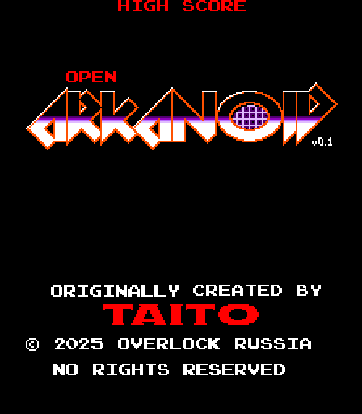

# Описание

Клон классический игры Арканоид версии 1986, реализованная на HTML5, CSS3 и JavaScript.

## Запуск

[ИГРАТЬ](https://Overlock7721.github.io/OPEN_ARKANOID_JS/)

## Управление

- **← → / A D** - движение платформы
- **ПРОБЕЛ** - запустить мяч / выстрелить лазером
- **P** - пауза
- **M** - вкл/выкл звук
- **T** - режим отладки

## Паверапы

1. **Лазер** - стрельба лазерами
2. **Увеличение** - увеличение платформы
3. **Разделение** - разделение мяча на три
4. **Захват** - возможность ловить мяч
5. **Замедление** - замедление мяча
6. **Прорыв** - мгновенное завершение уровня
7. **Доп. жизнь** - дополнительная жизнь

## Стек технологий

- HTML5 Canvas для рендеринга
- CSS3 для стилей
- Vanilla JavaScript для логики
- Web Audio API для звуков

Данный проект является лишь концептом, оригинальные уровни и некоторые анимации не реализованы в полной мере.
